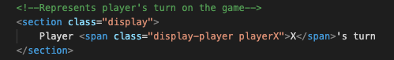
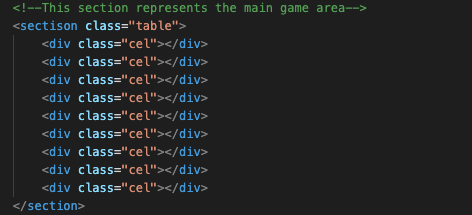
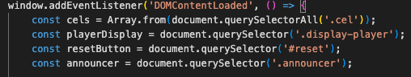
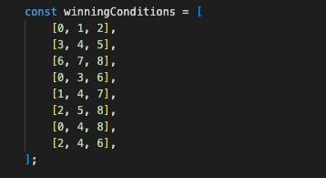

# Tic Tac Toe 2 Players

The purpose of this project is to plan and build a digital version of the game TIC TAC TOE. 
The main gol of this project is to explore and consolidate what I have learned on “Code Institute” subjects such as HTML, CSS and JavaScript.

## Game description and rules
Tic tac toe is an ancient game, has an uncertain origin, some researchers claim that this game was played in the ancient Egypt, others affirm that it was on the Roman Empire. Over the times the game and the rules haven’t change but the only way to play this game was with wood or rock pieces, mere recently with the pen and paper. Now a days since the technology has increased it has started to be built  it in a digital way. And that’s the gol of this project as well, to bring an ancient game on a digital way version. 

### Rules of the game:

1 - The game is played on a grid wich contains a game area divided into 3 squares by 3 squares.

2 - This game is meant to be played by two players that will be represented by an “X” and an “O”

3 - The First player to get of her marks in a raw (up, down, across or diagonally) wins the game.

4 - When all the 9 squares are full, the game is over and it’s a tie if none of the players got the 3 marks aligned.

### HTML

To start this project I will need a structure developed on HTML, and this structure will contain the following parts. 

-The title that will be just a section with an "h1" element 
-The display where it will be indicated who has the turn to play. This section contains a span element and this element will be manipulated by JavaScript functions to indicate who has the turn to play. That manipulation will take place thru the method “querySelector” that will change the text  as mentioned before. 

Straight below the display will be represented the main grid where all the fun will take place.
To build that section I have used the following elements: a main "Section" that contains nine empty "div" elements. The cels represented by div should remain empty. In this specific step I just need to add a (class=“cel”) to the "div" element to help me out on the future steps to be able to manipulate them thru CSS and JavaScript.  

 After the main game area I have another section with the element "div" representing the result of the game in case of a winner or a tie. This section will not be shown during the game, will pop up on the end of the game triggered by a JavaScript method.  

And the last element directly related to the game I have insert a reset button when is actioned by mouse click will reset the game area deleting everything that was introduced by the players on the game board. 

### CSS

 Using CSS I will be able to manipulate every element created on CSS.
The main elements manipulated on CSS as the background, all the text, dimensions and positions on the page. Since this project it’s related with a classic game I tried as much as possible to ad a “retro style” using basic colours that remind us of the classic video-games and a text-font according to this thematic as well. In this case I decided to use the font: “Silkscreen” from “Google Fonts”. Differently from a Webpage where the appearance and the UX it’s very important and requires lots of attention I decided to keep this project as simple as possible avoiding to add much visual information. However CSS was essential tool to create in a simple and easy way the grid where the game will take place. To do that attributes as “Display: grid;” and “grid-template-columns: 33% 33% 33%;” and “grid-template-rows: 33% 33% 33%;”  and “display: felx;” solved a big problem in the construction of the grid. In the beginning  of the project I was thinking to place a grid 9*9 as a background image and take it from there, but rapidly I understood that it’s a terrible idea because it’s much more complicated to manipulate the code inside of a image than doing it with HTML + CSS code. 

### JavaScript

JavaScript is the essential tool that allows all to happen thru the functions, methods and variables.  In this step of the project all of the HTML and CSS will be attached together.
To start the building process I added a “addEventListener” thru this method I can connect all the elements on HTML and manipulate them according to my needs. 

The “const” method will be useful as an reference to the array that is linked to the key elements on HTML as the Cels from the grid that when pressed will display the player symbol “X”or “O” and It will show who have the turn, the reset button that when is activated delete the game area and not less important the result of the game.

In sequence it’s important to set up the rules of the game, to do that on the code I will set up all the possibilities that the player has to win the game. In this case exists only 8 valid hypothesis to win the game and that hypostasis are represented by a sequence of 3 cels in a row that must be fulfilled by the player to achieve that gol. Using an array we represent that in java script in this way : const = [0, 1, 2], [3, 4, 5], [6, 7, 8], (…) [2, 4, 6], .

The next step is to establish a function that reads and execute al the actions taken by the players. 
For that is important to use an function called: “handleResultValidation” where I have 3 arrays and the operands most follow this rules: 
 If (a  === “” ||  b === “” || c === “”) then is a valid condition and means that the array “a” “b” and “c”  must be strict equal to the array board.

The other condition is to announce player X as a winner if the boar contain the symbol “X” three times in a row, the same is valid for the player that is represented by the symbol “O”. 

If none of the conditions above mentioned are true and the board if fluffed with 9 symbols distributed randomly the display should announce a TIE. 

The code was builded to be always the player “X” starting the game. 

### Color scheme:

For the background: #4faf44
Text color: #151a49

### Future features:

To improve this project, I plan to implement:
 - a single player option as well with at least 3 different levels of difficulty to make the game more interesting. At the same time I would implement as well a score board where it’s possible to keep track on the records. 

- Add some sound effect every-time a player take an action like klick on the cel or click the reset button, or the game finish with a certain result. 

### Credits: 

This project wold not be possible to build without a lot of online consultancy.
The websites used as a support for this project: 

I had some inspiration from this website to do this project:
https://dev.to/javascriptacademy/create-a-simple-tic-tac-toe-game-using-html-css-javascript-i4k

I used many times this 2 websites as an digital library to consult every time I was not sure about something:

https://developer.mozilla.org/en-US/docs/Web/API/EventTarget/addEventListener

https://www.w3schools.com/

My Font family was from google fonts:

https://fonts.google.com/about

The gradients inspiration come from this website:

https://www.schemecolor.com/90s-retro.php
 

