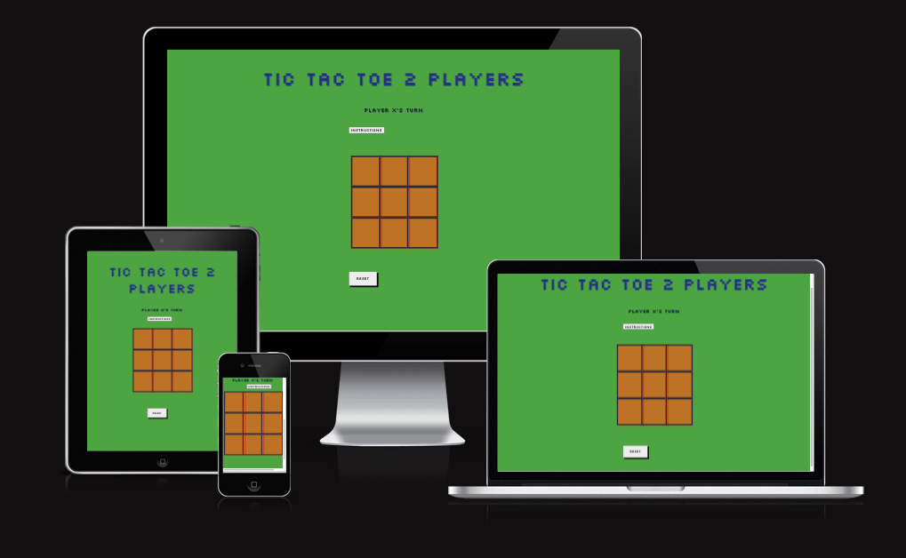
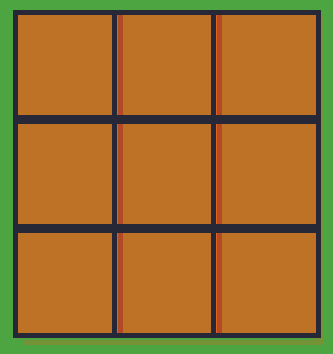
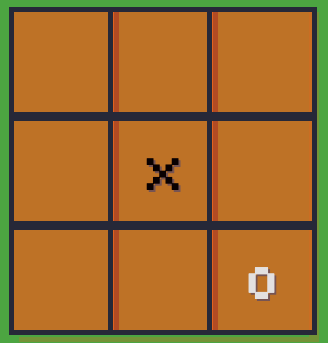
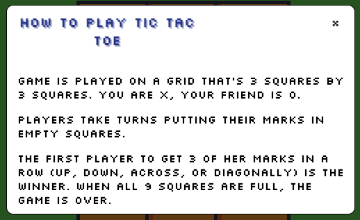
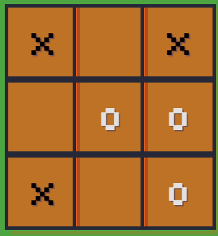

# Tic Tak Toe 

#
 Click here to play [Tic Tak Toe](https://andreisanduta.github.io/Tic_Tac_toe/)  

### Game and Rules 
Tic-tac-toe is an ancient game with an uncertain origin. Some researchers claim that this game was played in ancient Egypt; others affirm that it was in the Roman Empire. The game and the rules haven't changed over the years, but until recently, the only way to play this game was with wood or rock pieces, and then with pens and paper. With the advancement of technology, it has begun to be built digitally. And that’s the goal of this project as well: to bring an ancient game into a digital format.
Rules of the game:  
1: The game is played on a grid, which contains a game area divided into 3 squares by 3 squares.  
2: This game is meant to be played by two players, who will be represented by an “X” and an “O."  
3: The first player to get all of her marks in a row (up, down, across, or diagonally) wins the game.  
4: When all the 9 squares are full, the game is over, and it’s a tie if none of the players got the three marks aligned.  

#
 
### Features: 
 

* Game area:
 
The game takes place inside the orange square. Inside the square, the players can place their pieces by choosing one of the nine squares.

  

* In this game, just 2 pieces are allowed, and the players must decide among themselves who will start to play; the first player is always the “X” symbol, and the second player is the “0” symbol.

  

* Buttons: 

Instruction button: 

The instruction button, when clicked, shows the rules of the game.

  

* Reset Button.  
 
Whenever the player wants to reset the game, they can click the "reset" button and start over again.

   

 * Sounds 🔉 : 
 
The game has specific sounds for three different situations:  
1. When the player makes a move.
2.  when the button "reset" is clicked. 
3. When one of the players wins the game.

* Players turn: 

       

* Resoult display:

      

#

## Testing: 
 
The access link to the game was tested in different browsers, such as: Opera, Firefox, Microsoft Edge, Chrome, and Safari.
 
The game runs on all types of screens, from laptops to desktop screens.
 
### Functionality testing: 
 
The first feature to be tested is the "instructions."  When the button is clicked, a text box should open with the game's instructions.  

  

When the player is aware of the rules and feels confident to start playing, he can click either on the “x”  
symbol that will close the box or randomly somewhere on the screen, and the box should vanish and allow the game to start.

The feature works as it should after several testing scenarios on both the touch screen and desktop screen.   
“This feature can’t be shown through print screens; for that reason, I decided not to add any figures related to this feature.”

Sound testing: 

When the player chooses the correct place to insert his symbol, a feedback sound should be heard.  
 By testing several times, I confirmed that the sound is audible.

A sound should be heard after clicking the reset button.After several tests, I can confirm that it’s working as it should.

By winning the game, the players should hear a clarinet sound to confirm their victory. The sound is played after a victory is confirmed.

The reset button:

The reset button must erase all the symbols from the game board. By clicking the button,  
 I can confirm that this functionality is also working properly.

       

 #

 ### Bugs:

 Bugs:
 
After adding the sounds to the game, I realized that the sounds were not playing properly.  
I realized that the problem was that the sound function was not inside the main functions,  
which is why the sounds were not playing properly.

The winner was not being announced at all, then I realized that I should introduce "announce.innerHTML.”.  
I was not connecting the “announcer” function.
 
### Unfixed bugs: 
 
When two symbols are introduced on the board in less than one second, the sound is not audible.

#

## Validator testing. 

* No errors when passing through the W3C Validator. [HTML Validator](https://validator.w3.org/nu/?showimagereport=yes&doc=https%3A%2F%2Fandreisanduta.github.io%2FTic_Tac_toe%2F
)  

* No errors were returned when passing Jigsaw. [CSS Validator](https://jigsaw.w3.org/css-validator/validator?uri=https%3A%2F%2Fvalidator.w3.org%2Fnu%2F%3Fshowimagereport%3Dyes%26doc%3Dhttps%253A%252F%252Fandreisanduta.github.io%252FTic_Tac_toe%252F&profile=css3svg&usermedium=all&warning=1&vextwarning=&lang=en
)

* No errors were returned For JS code. [JS Validator](https://jshint.com/.)

#

## Deployment:  

* GitHub Pages was used to host the website. The following are the deployment procedures:
1. Navigate to the Settings tab in the GitHub repository.
2. To launch GitHub Pages, choose Pages from the menu on the left.
3. Change Branch to Main in the GitHub pages area by selecting it. By doing this, GitHub published the website in the repository and provided a link to it.

#

## Technologies used:
* HTML 
* CSS 
* JavaScript

#

## Credits:

* The rules was extracted from: [Rules](https://www.exploratorium.edu/brain_explorer/tictactoe.html)

* I had some inspiration from this website to do this project: [Inspiration project](https://dev.to/javascriptacademy/create-a-simple-tic-tac-toe-game-using-html-css-javascript-i4k)

* For the modal function a got some help watching this video: [▶️ Video](www.youtu.be/nAAZs9xLYQk)

* I used this website as a digital library many times when I was unsure about something.: [Blog](https://developer.mozilla.org/en-US/docs/Web/API/EventTarget/addEventListener/)

